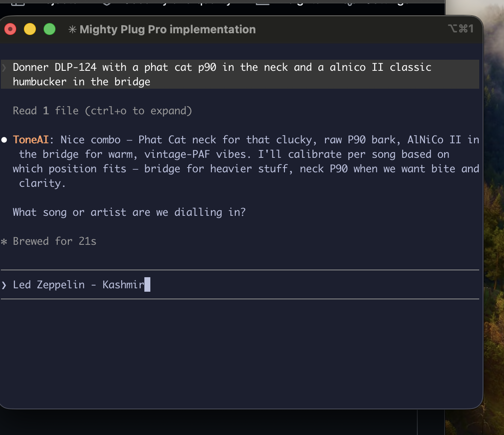
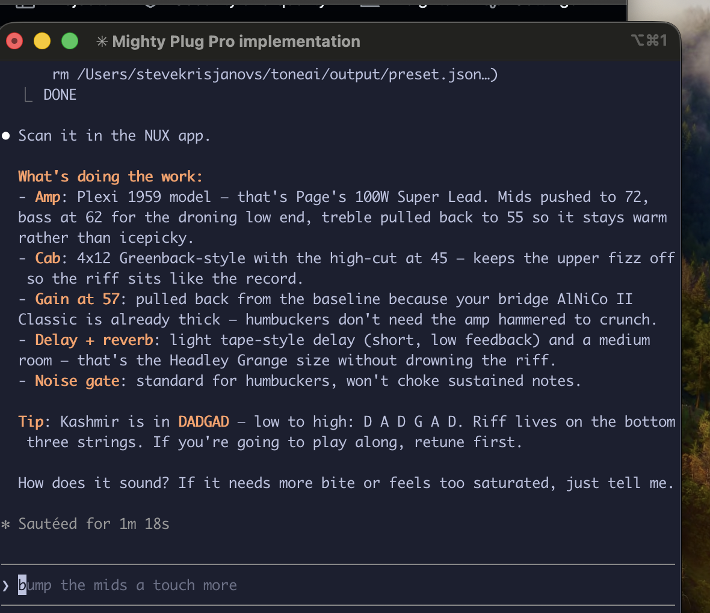
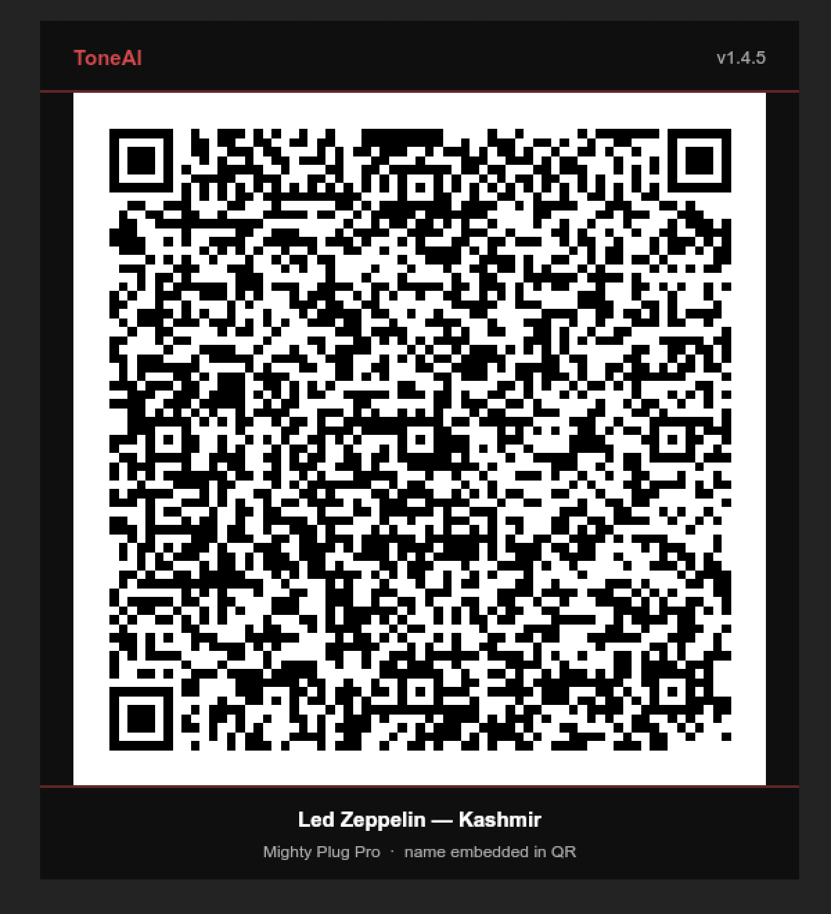

# ToneAI

Tell ToneAI what song you want to sound like. It searches the web for the original recording gear, builds a NUX MightyAmp preset, and saves a QR code you scan straight into the NUX app.

It runs inside your existing AI account — Claude, Gemini, or OpenAI. No API keys. No extra subscription. Download, open, and play.

Real session, asking for Kashmir on a Plug Pro:







---

## Getting started

### The easy way — Claude web and mobile (start here)

No terminal, no install, works on your phone.

1. Download **`toneai-nux-skill-v<version>.zip`** from the [latest release](https://github.com/cordfuse/toneai-nux-imprint/releases/latest) — the small one, about 600 KB.
2. In a **web browser**, go to claude.ai → **Settings → Skills** (beneath Customize), click **Upload skill** and choose the ZIP. Don't unzip it.
3. That's it. ToneAI is in every chat from then on, web and mobile.

> **The import has to happen in a browser.** The Claude mobile app doesn't surface the skill-import screen — there's no way to add a custom skill from the app. Do it once at claude.ai in a browser (a phone browser is fine); after that the skill lives on your account and the mobile app picks it up like any other chat.

Ask for a tone — *"dial in the Comfortably Numb solo, I'm on a Mighty Plug Pro with a Les Paul"* — and it hands you the QR. Scan it in the NUX app.

It asks once which NUX device and pickups you have, then remembers. The skill brings its own QR generator and runs entirely inside Claude's sandbox — no network, no dependencies. Presets are byte-identical to the desktop app's: it's the same encoder.

Skills work on **every** Claude plan, including Free. The one requirement is that **code execution is switched on** in your Claude settings — the skill runs the generator, so it needs it.

---

## Desktop (agent CLI)

For local files and offline use. **This one needs a command line** — if that's not for you, the skill above gives you the same tones.

### Install

1. **Install Node.js first** if you don't have it — [nodejs.org](https://nodejs.org) (any current LTS).
2. Download `toneai-nux-imprint-v<version>.zip` from the [latest release](https://github.com/cordfuse/toneai-nux-imprint/releases/latest) and extract it.
3. Open the folder in an agent CLI and say hello.

No build step: the QR generator is plain JavaScript and runs on a bare Node, with no dependencies and no network calls.

### Launch

```
cd toneai-nux-imprint
claude        # or: gemini / agy / codex / opencode
```

**Supported agents (any desktop OS):**

| Agent | Command |
|---|---|
| Claude Code | `claude` |
| Gemini CLI | `gemini` *(⚠ OAuth/Google-One unpaid tier sunsets 2026-06-18 — migrate to Antigravity below)* |
| Antigravity CLI | `agy` *(Google's official Gemini CLI successor)* |
| Codex CLI | `codex` |
| OpenCode | `opencode` |

On first launch ToneAI asks which NUX device you have, where to save QR images, and whether you play guitar or bass. After that it goes straight to work each session.

### Not supported

| Surface | Status |
|---|---|
| Claude Desktop (Chat / Cowork / Projects) | ❌ Hardened against persona injection — refuses pipe install, blocks IMPRINT.md as a jailbreak vector, Cowork has a locked system prompt |
| ChatGPT Desktop | ❌ Sandboxed — no local network or filesystem access |
| Gemini Desktop | ❌ Requires manual project seeding each session — not viable as a recurring tool |
| Claude Projects | ❌ ZIP uploads not accepted — use the Skill above |
| ChatGPT web | ❌ Safety layer rejects the persona-takeover pattern |
| Gemini web | ❌ Emits a JSON output file instead of running as ToneAI |

If none of these fit, use the [Mighty AI QR web app](https://mighty-ai-qr-web.onrender.com) — same NUX-tone-from-prompt experience, browser-hosted, no install.

---

## How it works

You give ToneAI a song, an album, or just an artist name. It searches for the original recording gear — which amp, which guitar, which effects — then maps that to the closest available models on your device. The preset comes out as a decorated PNG QR code saved to your output folder.

Scan it in the NUX app and you're playing.

```
ToneAI: What song or artist are we dialling in?

You: Comfortably Numb

ToneAI: Gilmour used a Hiwatt DR103 into a Hi Watt 4x12 for the solos,
        with a Colorsound Power Boost and CE-2 chorus. On the Plug Pro
        I'm mapping that to the Brit 100 amp, a touch of chorus in the
        efx slot, and a long plate reverb. Single coils on the Strat,
        so I've nudged the gain up slightly and raised the noise gate.
        Generating...

        Saved to ~/Documents/ToneAI/PinkFloyd-ComfortablyNumb.png
        Scan it in the NUX app. How does it sound?
```

ToneAI keeps a roster of your instruments. Switch mid-session and it recalibrates:

```
You: Grabbing the Les Paul

ToneAI: Switching to the Les Paul — pulling back gain a touch for humbuckers.
```

For albums, one request generates a full set — one preset per track, researched individually.

---

## Supported devices

**Pro format** (full effect chain, preset name embedded in QR):
`Plug Pro` · `Space` · `Lite MK2` · `8BT MK2` · `20BT MK2` · `40BT MK2` · `60BT MK2`

**Standard format** (device-specific effect IDs):
`Plug Air V1/V2` · `Mighty Air V1/V2` · `Mighty Go` · `Lite` · `8BT` · `20/40BT (original)` · `40BT (original)`

Bass players: BassMate amp, TR212Pro cab, compressor always on.

---

## Requirements

**Claude Skill (the easy way):** any Claude plan, including Free — with **code execution** enabled in your settings. Nothing else.

**Desktop:**

- An AI agent CLI with an active account ([Claude Code](https://claude.ai/download), [Gemini CLI](https://github.com/google-gemini/gemini-cli), [Antigravity CLI](https://github.com/google-antigravity/antigravity-cli), [Codex](https://platform.openai.com/codex), or [OpenCode](https://opencode.ai))
- Node.js

**Both:** a NUX MightyAmp device and the NUX app to scan QR codes.

---

<sub>Built on [Imprint](https://github.com/cordfuse/imprint)</sub>
